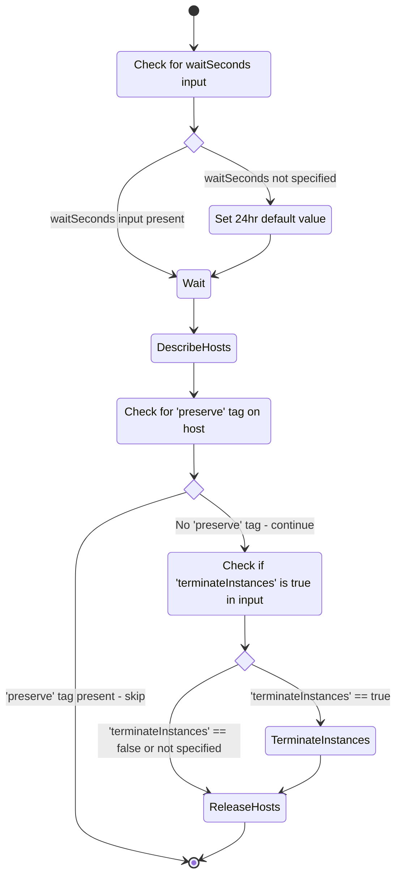

# ec2-mac-releaser
Automation to release EC2 Mac dedicated hosts after their [minimum 24 hour period](https://docs.aws.amazon.com/AWSEC2/latest/UserGuide/ec2-mac-instances.html#mac-instance-release-dedicated-host).

This stack comprises of a Step Function, and associated EventBridge trigger rule to allow automatic invocation whenever a new `mac1` or `mac2` dedicated host is provisioned.

High level Step Function flow:


## Usage
This stack uses [SAM](https://aws.amazon.com/serverless/sam/) - once you have that setup, you can then build and deploy with
```bash
sam build
sam deploy --guided
```

Once deployed, the Step Function will automatically trigger and begin its 24 hour countdown whenever any new `mac1.metal` or `mac2.metal` dedicated hosts are created in that region.

If you want to opt out a new host from being automatically released, you can tag it with the key `preserve` (value doesn't matter), and this will cause it to be ignored when the Step Function executes.

### Manual invocation
You can also execute the Step Function manually. At a minimum it requires the target dedicated host ID - this will cause it to use the default 24 hour wait duration:
```json
{
  "targetHosts": [
    "the target dedicated host ID - will start with h-"
  ]
}
```

You can also override the default wait duration with a custom value (in seconds), as well as specifying whether to terminate instances on the dedicated host (`false` by default):
```json
{
  "targetHosts": [
    "the target dedicated host ID - will start with h-"
  ],
  "waitSeconds": 60,
  "terminateInstances": true
}
```

## Caveats
As with releasing any other types of dedicated hosts, the call will fail if there are any instances running on them at the time. By default, this Step Function does not attempt to release any instances running on the target dedicated host, and instead marks the execution as failed.

This can be overridden by setting the `TerminateInstances` CloudFormation parameter to `"true"` in stack deployment, or for manual executions specifying `"terminateInstances": true` in the event.